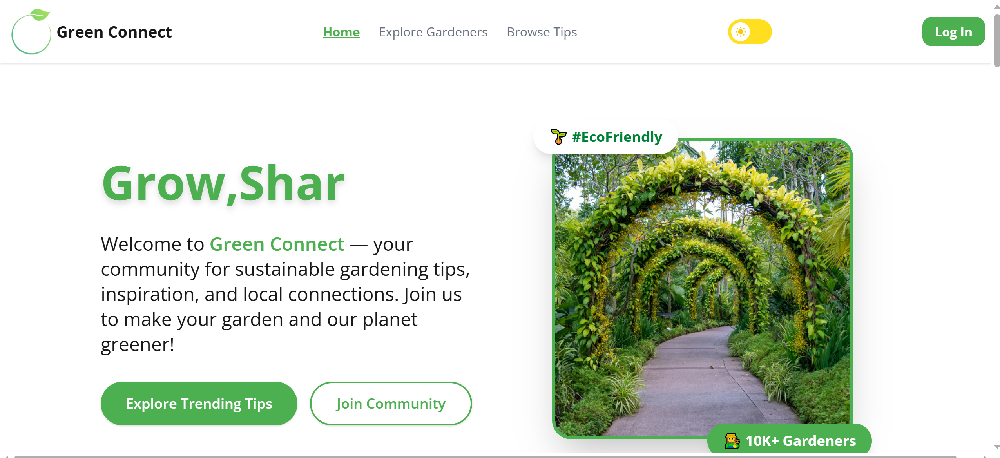
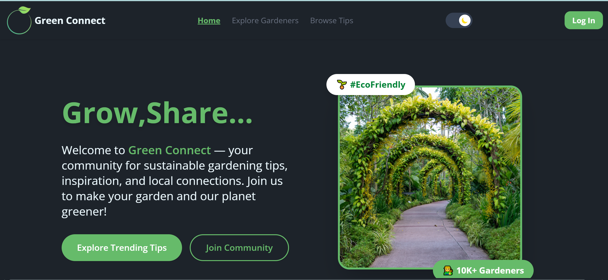
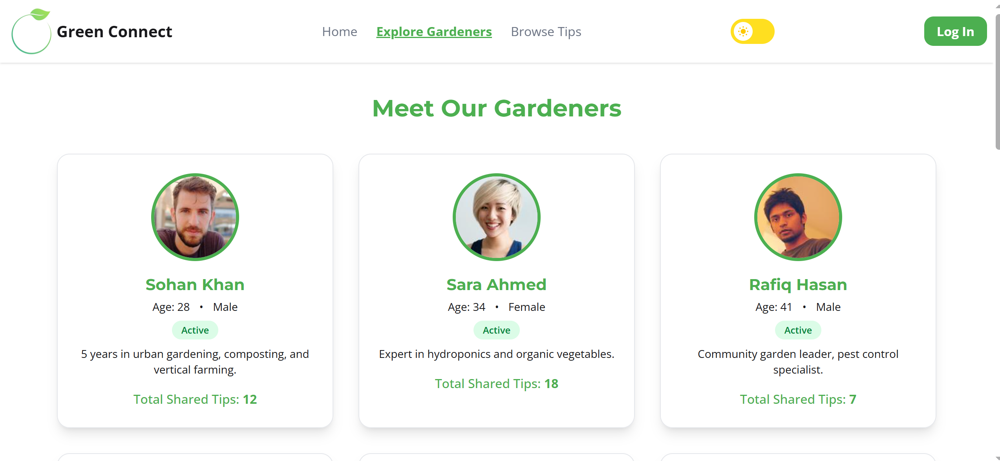
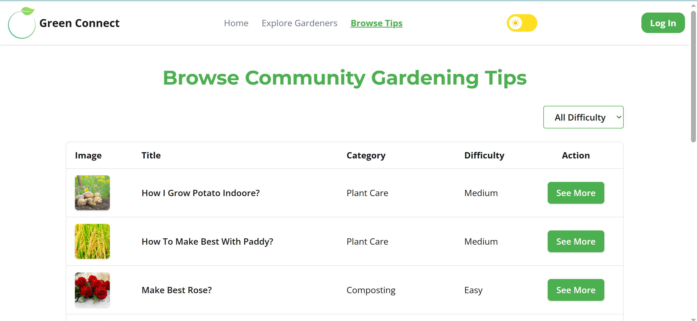
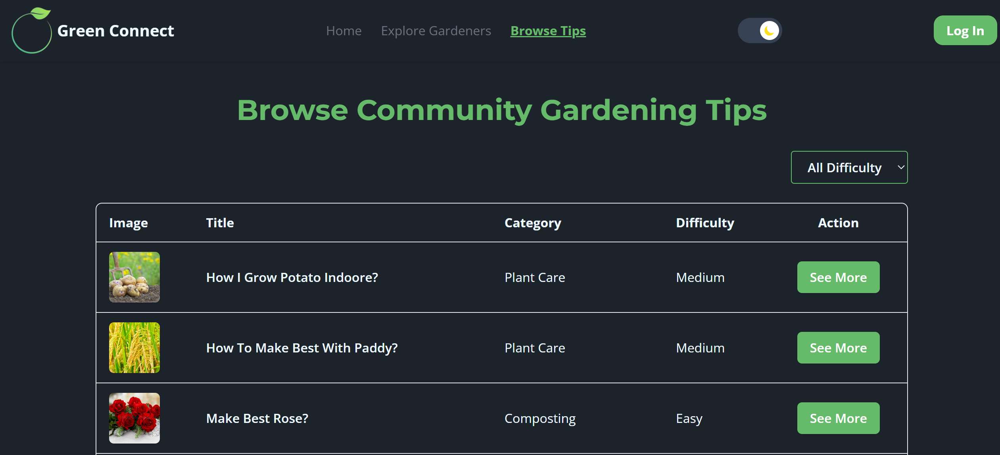

# 🌱 Green Connect

Green Connect is a modern community platform for discovering, sharing, and learning about sustainable gardening. Connect with local gardeners, browse expert tips, and contribute your own knowledge to help make our planet greener!

[](https://reactjs.org/)
[](https://tailwindcss.com/)
[](https://vitejs.dev/)
[](https://firebase.google.com/)
[](https://www.mongodb.com/)
[](LICENSE)

---

## 🌐 Server Repo

[View Green Connect Server Repo](https://github.com/tanmayislam2006/green-connect-server.git)

---
---

## 🌐 Live Demo

[View Green Connect Live](https://green-connect-app.web.app/)

---

## 📖 Table of Contents

- [About](#about)
- [Features](#features)
- [Screenshots](#screenshots)
- [Tech Stack](#tech-stack)
- [Installation](#installation)
- [Usage](#usage)
- [Contributing](#contributing)
- [License](#license)
- [Project Map](#project-map)

---

## 📌 About

**Green Connect** is your go-to hub for all things gardening. Whether you're a beginner or an expert, you can:
- Share your gardening tips and experiences
- Browse advice from fellow gardeners
- Join events and workshops
- Connect with a supportive, eco-friendly community

---

## ✨ Features

- 🌿 **Browse & Filter Tips:** Discover community gardening tips by category and difficulty
- 📝 **Share Your Tips:** Contribute your own gardening knowledge and inspire others
- 👩‍🌾 **Explore Gardeners:** Meet and connect with active gardeners in your area
- 🔒 **Authentication:** Secure login and registration with Firebase
- 🎨 **Theme Toggle:** Switch between light and dark modes
- 📱 **Responsive Design:** Looks great on all devices
- 🚀 **Smooth Animations:** Engaging AOS scroll-based transitions
- 🔔 **Toast Notifications:** Instant feedback for user actions

---

## 🖼️ Screenshots

> _Add screenshots or GIFs here to showcase your UI!_







---

## 🛠️ Tech Stack

| Tool                                                        | Description                                        |
| ----------------------------------------------------------- | -------------------------------------------------- |
| [React](https://reactjs.org/)                               | UI library for building component-based interfaces  |
| [Vite](https://vitejs.dev/)                                 | Fast bundler and dev server                        |
| [Tailwind CSS](https://tailwindcss.com/)                    | Utility-first CSS framework                        |
| [Firebase](https://firebase.google.com/)                    | Auth & backend services                            |
| [React Router](https://reactrouter.com/)                    | Client-side routing                                |
| [AOS](https://michalsnik.github.io/aos/)                    | Animate On Scroll for transitions                  |
| [React Toastify](https://fkhadra.github.io/react-toastify/) | Toast notifications                               |
| [React Icons](https://react-icons.github.io/react-icons/)   | Icon packs                                         |

---

## 🗺️ Project Map

The Green Connect project is organized as follows:

```
green-connect-client/
├── public/                  # Static assets and index.html
├── src/
│   ├── Assets/              # Images, logos, and static media
│   ├── Components/          # Reusable UI components (Navbar, Loader, ThemeToggle, etc.)
│   ├── Context/             # React context for global state (e.g., GreenContext)
│   ├── Firebase/            # Firebase configuration and initialization
│   ├── Pages/               # Main page components (BrowseTips, ExploreGardener, etc.)
│   ├── Router/              # App routing configuration
│   ├── Styles/              # Global and custom styles (if any)
│   ├── App.jsx              # Main app component
│   └── main.jsx             # Entry point for React
├── .env                     # Environment variables (not committed)
├── package.json             # Project dependencies and scripts
└── README.md                # Project documentation
```

- **Pages/**: Contains all main route components (e.g., BrowseTips, ShareTips, MyTips, etc.)
- **Components/**: Contains shared UI elements (Navbar, Loader, ThemeToggle, etc.)
- **Context/**: Holds React context for authentication and global state.
- **Firebase/**: Firebase setup and configuration files.
- **Assets/**: Images and static files used throughout the app.

---

## 💡 Usage

- **Browse Tips:** View and filter gardening tips by difficulty or category.
- **Share Tips:** Log in and submit your own gardening advice.
- **Explore Gardeners:** See profiles of active community members.
- **Theme Toggle:** Switch between light and dark mode.
- **My Tips:** Manage your submitted tips.

---

## 🤝 Contributing

Contributions are welcome! Please open an issue or submit a pull request for improvements or bug fixes.

---

## 📄 License

This project is licensed under the [MIT License](LICENSE).

---

> _Made with 🌱 by the Green Connect community_
